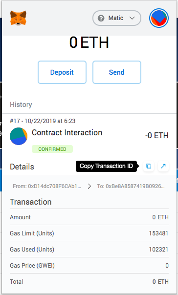
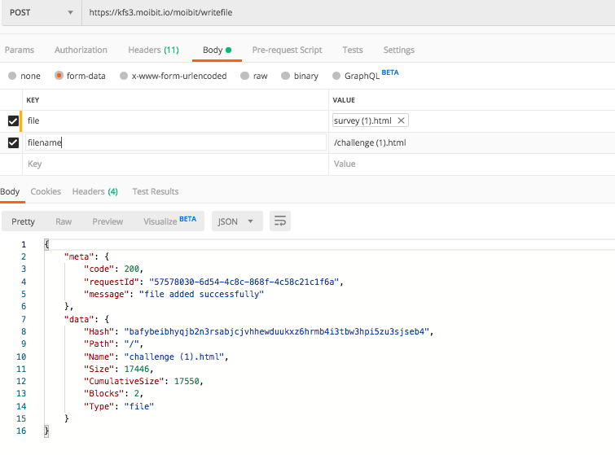
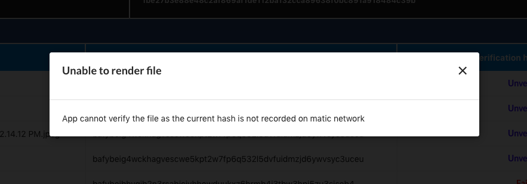

# MoiBit Sample DApp on Matic Network

[](https://join.slack.com/t/moibit/signup)
[](https://t.me/moibit)
[](https://twitter.com/moibitio)


This sample decentralized application uses the [**@moibitjs/matic SDK**](https://github.com/moibit/matic) as an off-chain storage platform for DApps running on [**Matic Network**](https://matic.network).  
All the file management features demonstrated in the DApp are enabled using the [MoiBit platform](https://www.moibit.io/?promocode=matic&utm_source=moibit-github-sample-dapp&utm_medium=github&utm_campaign=matic-sample-dapp).

## What does the DApp do?

The sample DApp allows the authenticated MoiBit users to upload their files to MoiBit and store the corresponding hashes of the files on Matic network for provenance purposes. It also allows users to view and list the uploaded files.

The sample DApp also allows users to view the file only if off-chain hash of the file matches with on-chain hash, and wherein the hashes do not match, acknowledge that file change was not recorded on Matic network.

## Tech Stack Involved

- React    - Front end library
- Solidity - The language used to build smart contracts that run on Ethereum
- MoiBit  - A decentralized storage network with reliable infrastructure and APIs
- Matic - An ethereum plasma sidechain based on EVM with lightning speed

### Let’s Get Started!
> **IMPORTANT NOTE:**  
> 1. You need to signup for the MoiBit API to complete this tutorial. Click [here](https://account.moibit.io/#/signup?promocode=5db0196943958f403e1cd0e8) to create your MoiBit account.  
> 2. Once you create and verify your MoiBit account, be sure to update the /src/middleware/credentials.js file with your proper credentials for the sample DApp to work.  
> 3. Also, Make sure you already have the Metamask downloaded. If not, download it from  [here](https://metamask.io/).

#### Install the following dependencies:

[Create React App](https://github.com/facebookincubator/create-react-app) is an intuitive package and is the best way to start building a new [single page](https://reactjs.org/docs/glossary.html#single-page-application) application in React.


``` bash
npx create-react-app moibit-sample-dapp
cd moibit-sample-dapp
npm install --save web3 maticjs #matic sdk with web3'
npm install --save @moibitjs/matic #moibit matic bundle 
npm install semantic-ui-react --save #front-end development framework
npm install file-saver --save #enable us to download files
```

#### Let's go into the details

> **IMPORTANT NOTE:** Make sure your Metamask is pointing to the matic sidechain. Learn more [here](https://docs.matic.network/newbies/conf-testnet-metamask/).

in **_src/container/dapp.js**

``` js
import React, { Component } from 'react';
import Layout from '../component/layout.js';
import '../App.css';
class Dapp extends Component {
    render() {
        return (
            <Layout />
        );
    }
}
export default Dapp;
```
renders below layout


in **_src/component/tableList.js_**

``` js
import React from 'react';
import { Table,Icon } from 'semantic-ui-react';
import '../App.css';
class TableList extends React.Component {
    state = {
        props1 : this.props
    }
    componentWillReceiveProps(newProps) {
        this.setState({props1 : newProps});
    }
    render() {
        const custom_primary = {
            backgroundColor: '#2185d0',
            color: '#fbfbfb',
            border: '1px solid #fbfbfb'
        }
        return (
            <Table celled >
                <Table.Header >
                    <Table.Row>
                        <Table.HeaderCell style={custom_primary}>
                            File Name
                                        </Table.HeaderCell>
                        <Table.HeaderCell colSpan='2' style={custom_primary}>
                            File Hash
                                        </Table.HeaderCell>
                        <Table.HeaderCell textAlign="center" style={custom_primary}>
                            Verified (Auto verification happens when you view file)
                                        </Table.HeaderCell>
                    </Table.Row>
                </Table.Header>
                <Table.Body>
                    {this.state.props1.fileList.length == 0 ? 
                        <Table.Row>
                            <Table.Cell />
                            <Table.Cell colSpan='2' textAlign="center">
                              No Data
                            </Table.Cell>
                            <Table.Cell />
                        </Table.Row> :
                        this.state.props1.fileList.map(aFile =>
                        <Table.Row key={aFile.fileName}>
                            <Table.Cell onClick={() => this.state.props1.readFile(aFile.Hash,aFile.Name) } className="hashHover">
                                {aFile.Name}
                            </Table.Cell>
                            <Table.Cell colSpan='2'>
                              <p>  {aFile.Hash}</p>
                            </Table.Cell>
    
                            <Table.Cell textAlign="center">
                                {aFile.verfiledBoolean == 0 ? 
                                    <h5 style={{color:'blue'}}>Unverified</h5> : 
                                    aFile.verfiledBoolean == 1 ? 
                                    <h5 style={{color:'green'}}>Passed</h5> : 
                                    aFile.verfiledBoolean == -1 ? 
                                    <h5 style={{color:'red'}}>Failed</h5> :
                                    <Icon loading name='spinner' size="large" />
                                }
                            </Table.Cell>
    
                        </Table.Row>
                    )}
    
    
                </Table.Body>
            </Table>
        );
    }   
}
export default TableList;
```

This is a re-usable component for rendering the list of files in table format

in **_src/component/modal.js**

``` js
import React from 'react';
import { Image,Modal} from 'semantic-ui-react';
import FileSaver from 'file-saver';


const showModal = (props) => {
    return (
        <Modal open={props.modalOpen} size="small">
            <Modal.Header>
                <div style={{ display: 'flex', justifyContent: 'space-between' }}>
                    <p> {props.fileName}</p>
                    <p style={{cursor:'pointer'}} onClick={props.modalClose}>&#10005;</p>
                </div>

            </Modal.Header>
            <Modal.Content image >
                {props.fileType === "image/png" || props.fileType === "image/jpeg" || props.fileType === "image/gif" ?

                    < Image wrapped size='medium' src={props.responseData} style={{ marginLeft: '25%' }} />
                    : props.fileType === "text/alert" ?
                        <p>{props.responseData}</p>
                    :
                    <div>
                        <h3 style={{float:'left'}}>No preview available. 
                            <span style={{color:'#2185d0',marginLeft:'15px',cursor:'pointer'}} onClick={()=>FileSaver.saveAs(props.responseData,props.fileName)}>Download</span>
                        </h3>
                    </div>
                }
            </Modal.Content>
        </Modal>
    );
}
export default showModal;
```

This is a re-usable component for render/download the requested file to view


in **/src/component/layout.js**

``` js
import React, { Component } from 'react';
import '../App.css';
import { Image, Table, Button, Input, Form } from 'semantic-ui-react';
import MoiBitLogo from '../moibit_logo_transparent.png';
import TableList from './tableList';
import credentials from '../middleware/credentials';
import ShowModal from './modal';
import Matic from 'maticjs';
import MFiles from '@moibitjs/matic';
class Layout extends Component {
    state = {
        fileList: [],
        file: '',
        loading: false,
        fieldReq: false,
        readFileIframe: '',
        fileType: '',
        modalOpen: false,
        fileName: '',
        files : {},
        API_KEY : '',
        API_SECRET : ''
    }
    async componentDidMount() {
        try {
            let _matic = new Matic({ 
                parentProvider : 'https://ropsten.infura.io/v3/70645f042c3a409599c60f96f6dd9fbc',
                maticProvider : window.web3.currentProvider 
            });

            var files = new MFiles(_matic);
            await files.init(credentials.CUSTOM_URL,{
                API_KEY : credentials.API_KEY,
                API_SECRET : credentials.API_SECRET
            });
            this.setState({
                files : files,
                API_KEY : credentials.API_KEY,
                API_SECRET : credentials.API_SECRET
            });
            this.getALLHashes();
        }catch(e) {
            console.log(e);       
        }
    }

    getALLHashes = async () => {
        let response = await this.state.files.list();
        let data = [];
        if(response !== null) {
            for (let i = 0; i < response.length; i++) {
                if (response[i].Type === 0) {
                    await data.push({
                        Name :  response[i].Name,
                        Hash :  response[i].Hash,
                        verfiledBoolean : 0
                    });
                }
            }
        }
        this.setState({ fileList: data });
    }

    handleSubmit = async (e) => {
        e.preventDefault();
        if (this.state.file !== "") {
            this.setState({ loading: true });
            await this.state.files.add(this.state.file,this.state.file.name);
            this.setState({ loading: false });
            this.getALLHashes();
        }
        else {
            this.setState({ fieldReq: true })
        }
    }

    readFile = async (hash,name) => {
        let successs = true;
        let files = this.state.fileList;
        const index = files.map(e => e.Name).indexOf(name);
        if(files[index].verfiledBoolean === 0) {
            files[index] = {
                Name :  name,
                Hash :  hash,
                verfiledBoolean : 2
            }
            this.setState({fileList : files});
            var responseType = 'blob';
            this.state.files.read(name,responseType)
            .then(response => {
                    if(response.validation === undefined) {
                             files[index] = {
                            Name :  name,
                            Hash :  hash,
                            verfiledBoolean : 1
                        }
                        this.setState({
                            fileList : files,
                            readFileIframe: window.URL.createObjectURL(new Blob([response.data], {type:response.contentType})),
                            fileType: response.contentType,
                            fileName: name,
                            modalOpen: true 
                        })
                    }
                    else {
                        files[index] = {
                                    Name :  name,
                                    Hash :  hash,
                                    verfiledBoolean : -1
                        }
                        this.setState({
                            fileList : files,
                            readFileIframe: "App cannot verify the file as the current hash is not recorded on matic network",
                            fileType: 'text/alert',
                            fileName: 'Unable to render file',
                            modalOpen: true
                        });
                    }
            })
            .catch(error => {
                console.log(error);
            });
        }
        else {
            return successs;
        }
    }

    modalClose = () => {
        this.setState({ modalOpen: false });
    }
    render() {
        const custom_header = {
            backgroundColor: '#222222',
            color: '#fbfbfb',
            border: '1px solid #fbfbfb'
        }
        return (
            <div className="layoutBG">
                {this.state.fileName !== '' ? <ShowModal modalOpen={this.state.modalOpen}
                    modalClose={this.modalClose}
                    fileType={this.state.fileType}
                    responseData={this.state.readFileIframe}
                    fileName={this.state.fileName}
                /> : null}
                <div style={{ display: 'flex', color: '#fbfbfb', marginLeft: '42vw' }}>
                    <Image src={MoiBitLogo} height="60px" width="160px" />
                    {/* <h3 style={{ marginTop: '10px', fontSize: '26px' }}>MoiBit</h3> */}
                </div>
                <div className="table_body_scrollable">
                    <Form onSubmit={(event) => this.handleSubmit(event)} encType="multipart/form-data">
                        <Table celled size="small" style={{ marginTop: '20px', marginBottom: '40px', background: '#f2f2f2', color: '#222222' }}>
                            <Table.Header>
                                <Table.Row>

                                    <Table.HeaderCell style={custom_header}>
                                        <Table.Row>
                                            <Table.Cell textAlign="center" colSpan='2'>
                                                <Input type="file" onChange={(e) => {
                                                    this.setState({ file: e.target.files[0] });
                                                }} required name="file" style={this.state.fieldReq ? { border: '2px solid red', borderRadius: '5px' } : {}} />
                                            </Table.Cell>
                                        </Table.Row>
                                        <Table.Row>
                                            <Table.Cell colSpan='2' textAlign="center" >
                                                <Button primary type="submit" loading={this.state.loading} disabled={this.state.loading} >Submit</Button>
                                            </Table.Cell>
                                        </Table.Row>
                                    </Table.HeaderCell>

                                    <Table.HeaderCell style={custom_header}>
                                        <Table.Row>
                                            <Table.Cell colSpan='2'>
                                                API_KEY : {this.state.API_KEY}
                                            </Table.Cell>
                                        </Table.Row>
                                        <Table.Row>
                                            <Table.Cell colSpan='2'>
                                                <div style={{ wordWrap: 'break-word', width: '600px' }}>
                                                    API_SECRET : {this.state.API_SECRET}
                                                </div>
                                            </Table.Cell>
                                        </Table.Row>
                                    </Table.HeaderCell>
                                </Table.Row>
                            </Table.Header>
                        </Table>
                    </Form>
                    <div className="content-container">
                        <TableList fileList={this.state.fileList} readFile={this.readFile} />
                    </div>
                </div>
            </div>
        );
    }
}
export default Layout;
```

If you want to follow the same layout as above, please import the css from [here](https://github.com/moibit/Moibit-Sample-DApp/blob/matic-dapp/src/App.css).

And make sure you have added below script in the **/public/index.html** file to inject semantic.ui css.

`<link rel="stylesheet" href="//cdn.jsdelivr.net/npm/semantic-ui@2.4.2/dist/semantic.min.css" />`

We are all set. Yay! Now, execute the command to run the sample application:

``` bash
npm start
```

We have followed the same init script that is there in [Get Started](https://github.com/moibit/matic#get-started) from `@moibitjs/matic` to bind matic object with moibit account.

On clicking submit (`handleSubmit function`), the file will be added using function **_files.add(file,filename,options)_** which pops up the metamask to confirm the transaction.

You can see the transaction in etherscan (as shown below)

>

| Open Metamask | View Matic Explorer |
|---------------|---------------------|
|  |  |


to view all the files use **_files.list()_**. If none is specified as parameter, all the files in root will be returned, if not specified folder files.
  

> When read file triggers the function being used is **_files.read(filename_** . If response's validation is failed ., verified column will be *Failed*. If the hashes do match , the verified column value will be *Passed* and renders file. If the file has not been clicked yet it will have a value of *Unverified*.

  

After successful verification the file will display if the file type is viewable or it will be downloaded.
  

#### if you change the file off-chain by following the process below

  



  

When you click the file the verification will fail because it was changed off-chain and the off-chain hash no longer matches the hash of the file saved on-chain.

| Verification | On Click |
|---------------|----------------|
|  |  |


## Maintainers
1.  [Vuppala Sai Prashanth](https://github.com/its-VSP)
2.  [Arunprakash](https://github.com/Arunprakash1414)

## Reviewed by
1. Ayush Gupta
2. Ganesh Prasad Kumble

## Support

If you need more clarifications, feel free to join our Telegram or Slack community channels. You can also write us an email at [hello@moibit.io](mailto:hello@moibit.io)

## License

[GNU General Public License v3.0](https://github.com/moibit/Moibit-Sample-DApp/blob/master/LICENSE)
